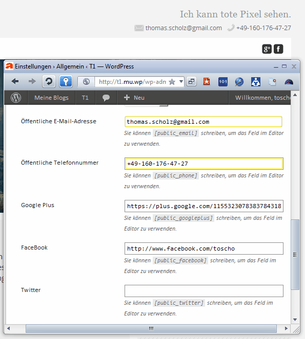

Public Contact Data
===================

WordPress plugin for your public visible contact data. Default fields:

	* Email
	* Phone number
	* Google Plus
	* Facebook
	* Twitter

You may extend or restrict the field list per filter.  
Sample code:

	add_filter( 'pcd_fields', 'change_pcd_fields', 10, 1 );
	function change_pcd_fields( $fields )
	{
		// remove an item
		unset ( $fields['facebook'] );
		
		// add an item
		$fields['github'] = 'GitHub';
		
		return $fields;
	}

You get a shortcode for each field build as `[public_$fieldname]`. 
So `[public_email]` will return the email, `[public_github]` the value from
your custom GitHub field.

There’s also an action named `pcd`. Its first parameter is the field name, the 
second an array of options:

	$defaults = array (
		'before' => '',
		'after'  => '',
		'link'   => TRUE,
		'print'  => TRUE
	);

To get an email link use:

	do_action( 'pcd', 'email', array ( 'before' => 'Email: ' ) );
	
The email address is always … obfuscated with `antispambot()`. 
Won’t help much, but it doesn’t hurt too.

The plugin is translatable. A German translation is already done. 
Language files are loaded in `wp-admin` only to save performance.

